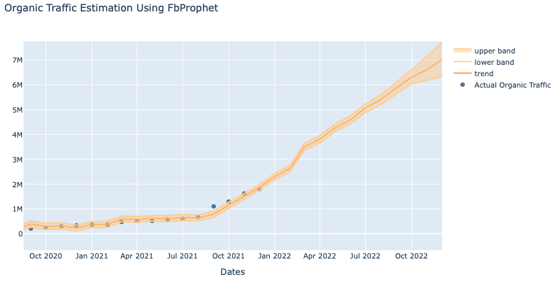
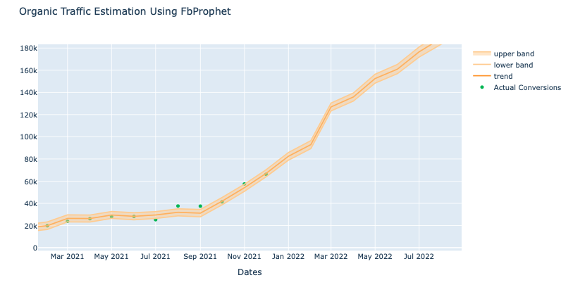
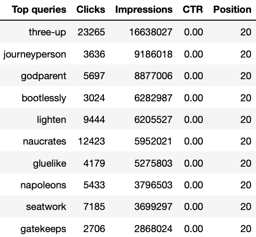
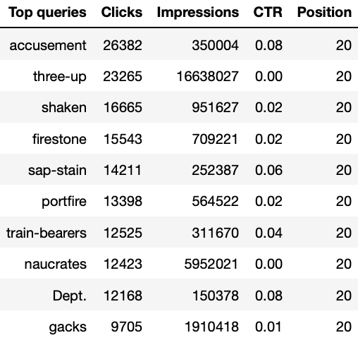
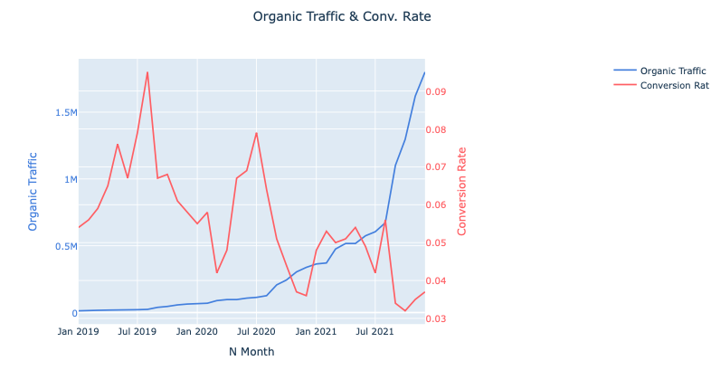

# Web Analysis Predictions w/ Prophet & SEO advices

## Motivation

Recently I received a few tasks to solve with two data frames. I was asked about approaches to predict the following year's monthly organic traffic and conversions, considering the growth through time and seasonalities, and present the results for the following 12 months. Instantly I remembered one of the most hyped regression models of the moment. The Facebook Prophet is an additive regression model that forecasts time series data based on non-linear trends, which is perfect for this job. The second task was establishing SEO guidelines on the data extracted from the Google Search console.

## Overview

* Data Preparation
* Data Exploration
* Prophet Organic Traffic Forecasting 
* Plot The Results
* Cross Validation
* Prophet Conversion Forecasting
* Plot The Results
* Cross Validation
* SEO Optimization
* Strategy
* Lower funnel users and qualifications strategy
* Awareness and session volume strategy
* Conclusion

## Resources Used
 **Python Version**: 3.7 
 **Packages**: pandas, datetime, fbprophet, plotly, sklearn

## Data  
Here I will used the data provided from the company website. Each line represents a month, and we have Five columns. 

* Year - Represent the year
* Month -  Represent the month of the row
* Organic Traffic - Contains session values  
* Conversion- That contains the number of conversions.  
* Conversion Value - That contains the value of the conversion values.  

 
## Fitting Model

The input to Prophet is always a data frame with two columns: ds and y. The ds (datestamp). The y column must be numeric and represents the measurement we wish to forecast.
The formula is :

 
 <strong >y(t) = g(t) + s(t) + h(t) + e(t)</strong>
 

  
 
Where:

- **y(t)** - Forecasting 
- **g(t)** - Trend models non-periodic changes (i.e. growth over time)
- **s(t)** - Seasonality presents periodic changes (i.e. weekly, monthly, yearly)
- **h(t)** - Ties in effects of holidays (on potentially irregular schedules ≥ 1 day(s))
- **e(t)** - Covers idiosyncratic changes not accommodated by the model

By default, the Prophet() object will work hard to figure out almost everything automatically. One of the assumptions is that the seasonalities are weekly and yearly. As expected, it delivered us an underfited mode. To achieve a better result, we will set fill parameters. 

**Parameters**

- **Specifying the locations of the changepoint** - Rather than use automatic changepoint detection, I manually specify the locations of potential changepoints with the changepoints argument. Slope changes will be allowed only at these points, with the exact sparse regularization as before. As noted in the data exploration, we will set the changepoint to '2021-09-01'

- **Adjusting trend flexibility** - If the trend changes are being overfitted (too much flexibility) or underfit (not enough flexibility), we can adjust the strength of the sparse using the input argument changepoint_prior_scale. By default, this parameter is set to 0.05. I made the trend more flexible, setting as 0.9.

- **Specifying Monthly Seasonalities** - I can add monthly seasonalities using the add_seasonality method and determine the period 30.5. To select how quickly the seasonality can change, we use the Fourier order as 1.

##  Results

MSE for 30 days: 0.88
MSE for 303 days: 1.62

MSE for 30 days: 1.10
MSE for 303 days: 2.04 

## Optimization

SEO experts should review the target keyword and identify terms to enrich the copy further. This ensures the content marketing strategy matches SEO best practices. The data provided were about Top Queries and seemed to be from Google Search Console.
Different impacts could be expected from two strategies of the SEO improvement roadmap.
### 3.1.1  - Lower funnel users and qualifications strategy 

Suppose the mean goal of the implementation is to achieve conversion. I suggest prioritizing the marketing content with queries with a high number of Impressions, high CTR, and low Positions. 

- Low position - opportunity to increase the results
- High Impressions - suggests that there is a high demand
- High CTR - Suggests that the company "answer" for this query is relevant.

In my opinion, it is the most effective strategy in terms of conversions. 
Sorting the table descending by Position, impressions, and CTR, the 10 top queries that should be prioritized are:

After 10K iterations, it seems that the bootstrapped conversion rate means changed for both of the groups. We can also note an intersection between the two groups since the max value of Conv. rate presented for the control is larger than the min Conv. rate value shown for the treatment group in this experiment. 

### Awareness and session volume strategy 

Once the mean goal of the SEO implementation is brand awareness and volume of traffic, I suggest starting the SEO implementation by a high number of clicks and low position, which is the most common approach by SEO professionals. 

The 10 top mean queries that should be prioritized are:

It should probably be the current company's strategy since the volume of organic sessions increased, and the conversion rate decreased through the last years. As the graph that represents the organic traffic and conversion rate shows.

## Conclusion

Those were my approaches to predicting traffic and conversion, considering the monthly seasonality with Prophet. The model was easy to use and presented promising results for the company with an increment in traffic and the number of conversions.
However, I note that the SEO strategy could be improved. I also presented a few simple pieces of advices for the SEO team, using the data provided and basic sorting features using Python to optimize the marketing content efforts looking to conversion rates. 
 
 
I will be happy I hear your approach as well.
 
 
I hope that kernel was useful, and I appreciate any comment, suggestion, or advice.
 
Thanks 

Author: Erick C. Varela
 
 
Date: 15/09/2022
